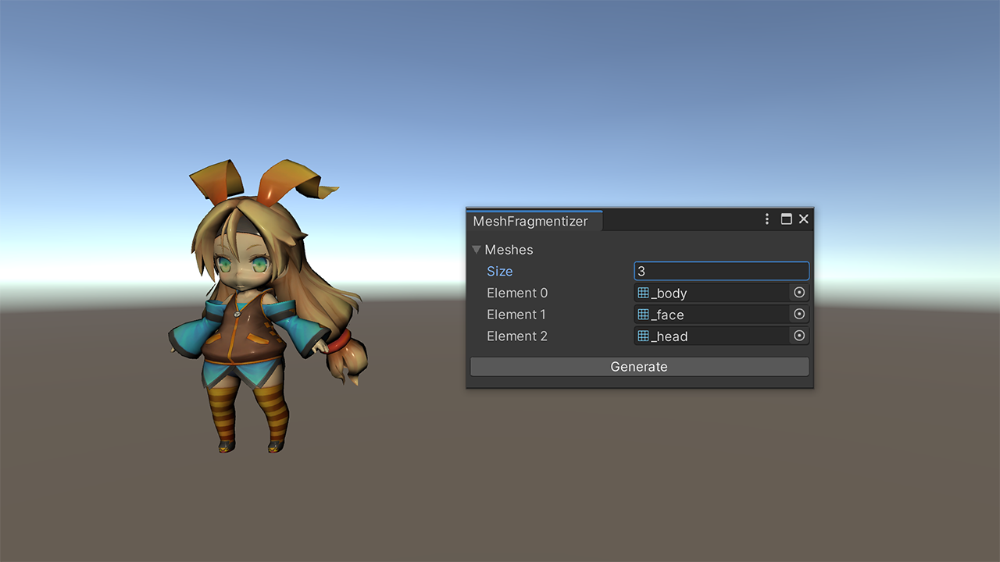

# unity-mesh-fragmentizer
Unity base runtime/editor mesh de-indexing library. Ordinary imported models(.fbx, .obj, etc...) are optimally indexed, which turn out to be each polygons adhere to each other.
This library offers polygon detaching method in runtime or editor-time. Either way it work with model animations.

## License
[MIT](LICENSE)

